<h1 align="center">
  Voluntariado agendamento
</h1>

<h4 align="center">Status: ✔ Concluído</h4>

---

<p align="center">
 <a href="#user-content-sobre-o-projeto">Sobre o projeto</a> |
 <a href="#user-content-funcionalidades">Funcionalidades</a> |
 <a href="#user-content-executando-o-projeto">Executando o projeto</a> |
 <a href="#user-content-tecnologias">Tecnologias</a>
</p>

---

## **Sobre o projeto**

Projeto integrador para gestão de escalas da ONG "Doutores Panacéia", desenvolvido em Spring boot e Angular.

<div align="center">
  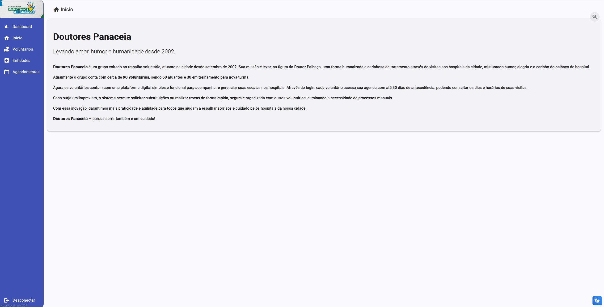
</div>


## **Funcionalidades**

O projeto contém as funcionalides:


- Cadastro de voluntários.

<div align="center">
  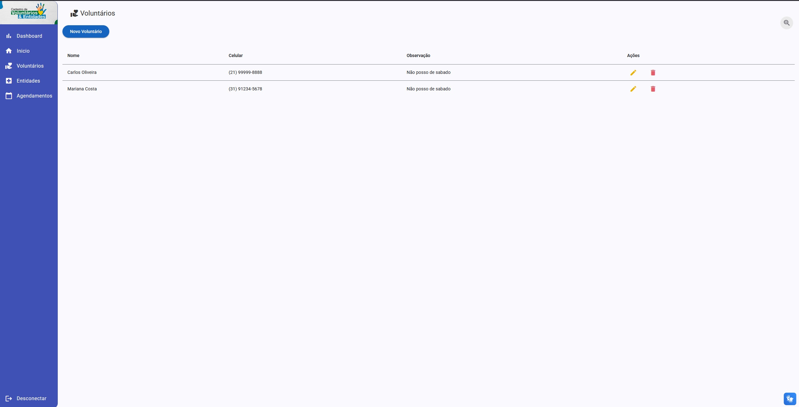
</div>

<div align="center">
  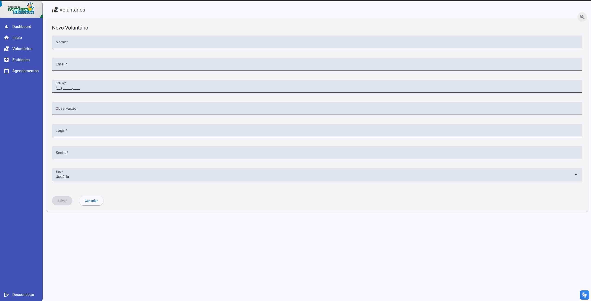
</div>

<div align="center">
  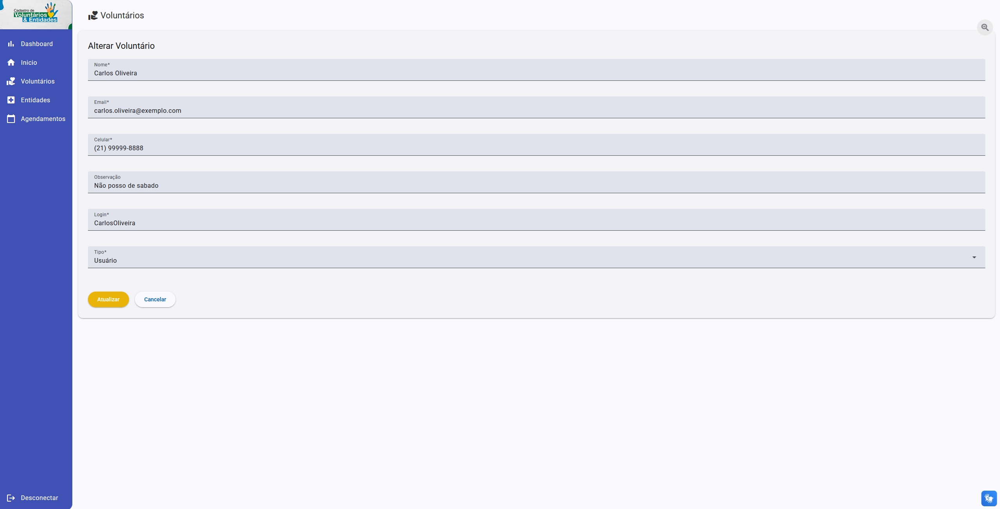
</div>

<div align="center">
  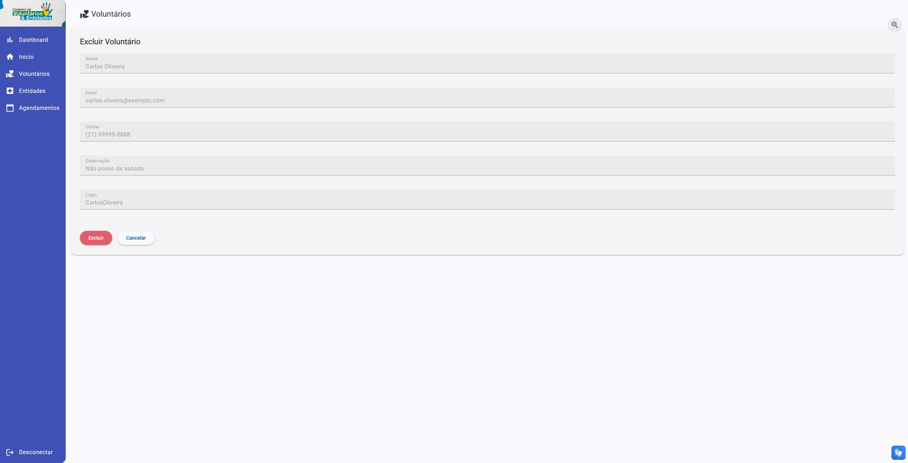
</div>

- Cadastro de entidades.

<div align="center">
  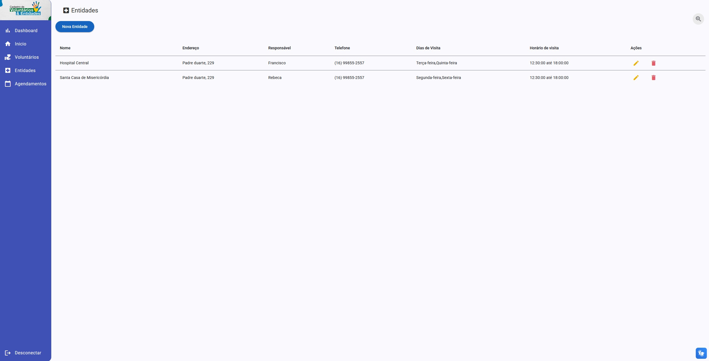
</div>

<div align="center">
  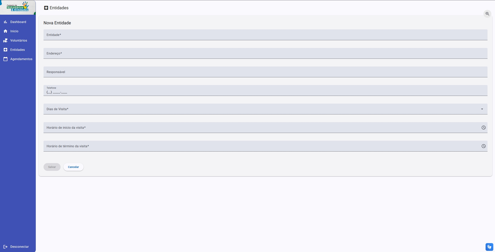
</div>

<div align="center">
  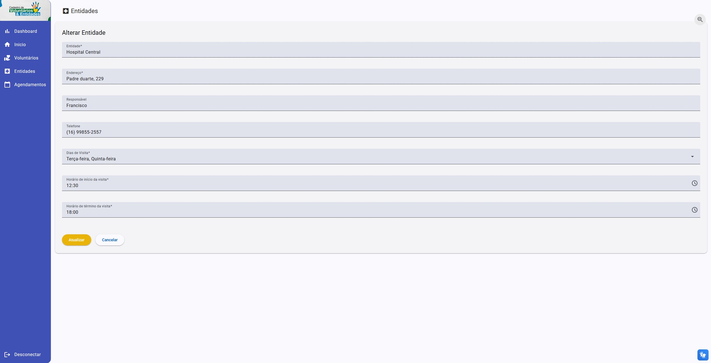
</div>

<div align="center">
  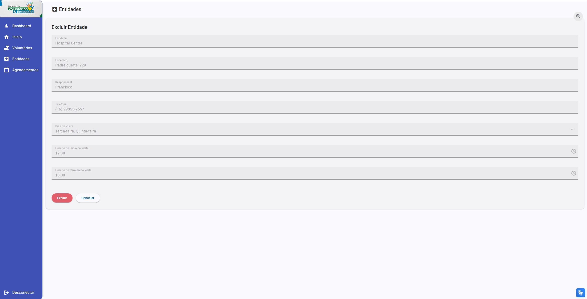
</div>

- Cadastro de agendamentos de visitas.

<div align="center">
  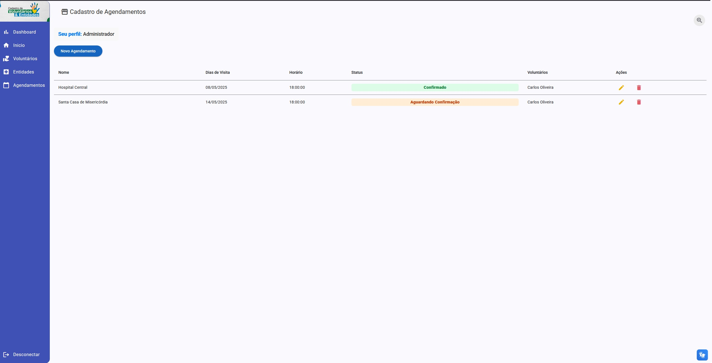
</div>

<div align="center">
  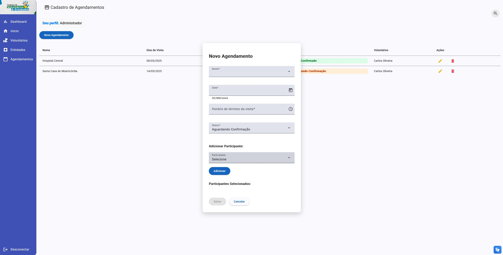
</div>

<div align="center">
  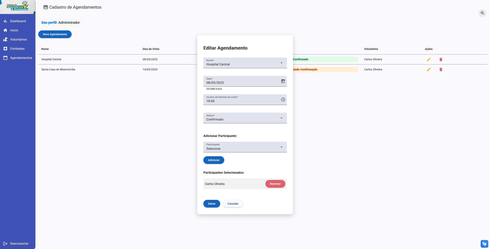
</div>

<div align="center">
  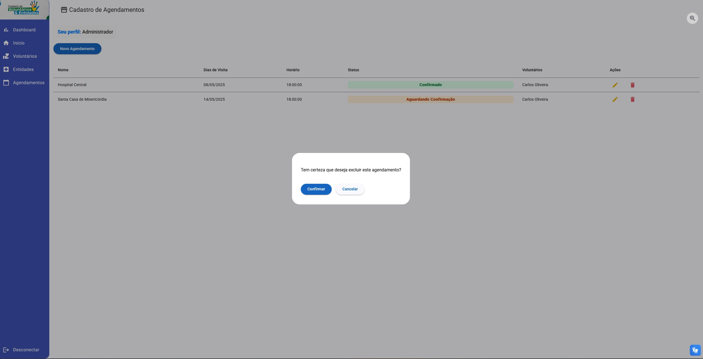
</div>

- Integração com o VLibras para acessibilidade.

<div align="center">
  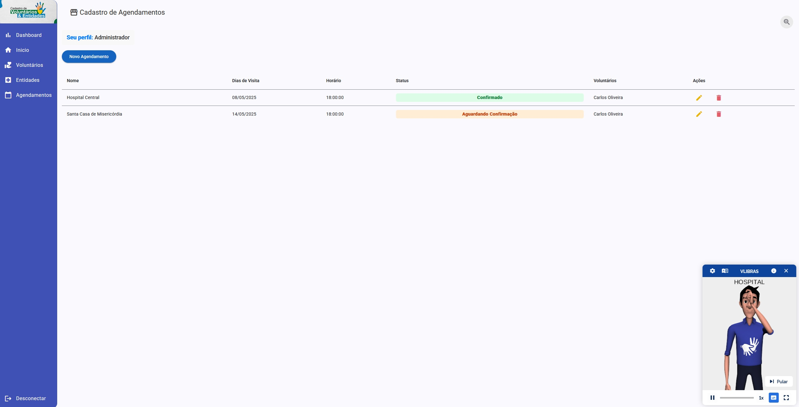
</div>

- Botão de alteração do tamanho da fonte para a acessibilidade.

<div align="center">
  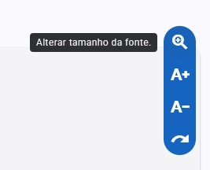

  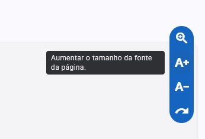

  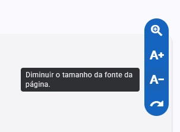

  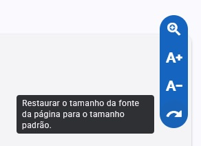
</div>

<div align="center">
  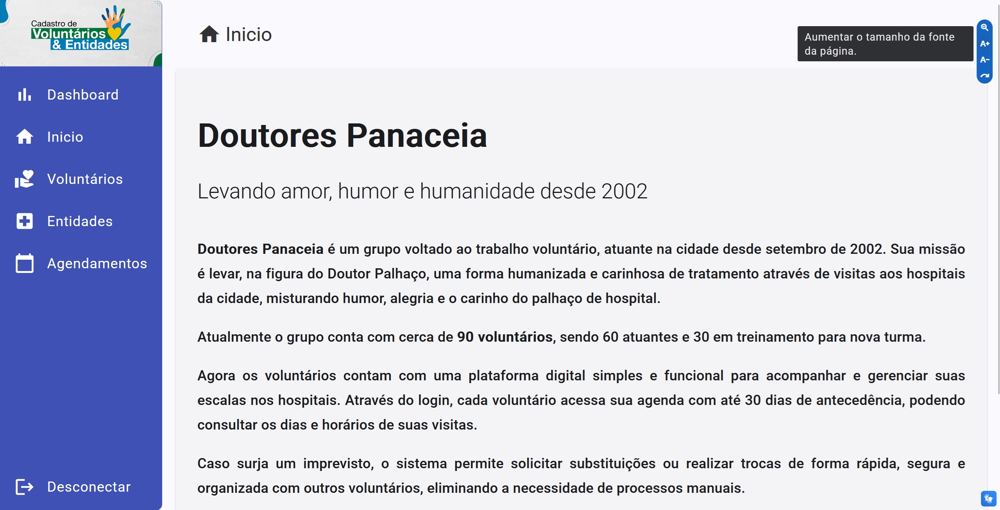
</div>

- Dashboard para análise da distribuição das escalas por dia da semana, período, por entidade, além da taxa de participação dos voluntários e quantidade de entidades visitadas.
<div align="center">
  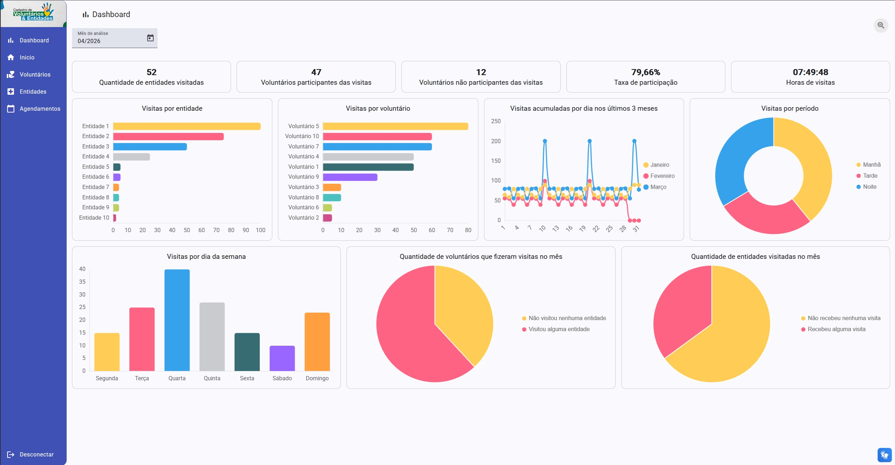
</div>


## **Executando o projeto**

### Pré-requisitos

-   NodeJS ( versão utilizada: 22.12.0 )
-   Npm ( versão utilizada: 10.9.0 )
-   Angular CLI ( versão utilizada: 19.1.7 )
-   Java ( versão utilizada: 17 )
-   Apache Maven ( versão utilizada: 3.9.11 )

### Instruções adicionais

Por padrão, a aplicação vai buscar os dados em nosso back-end no endereço `http://localhost:8080`. Para alterá-lo, modifique a propriedade `apiUrl` do arquivo `frontent/src/environments/environment.ts`.

A configuração do CORS irá permitir a origem `http://localhost:4200` e `http://127.0.0.1:4200` por padrão. É possível alterá-la através da propriedade `voluntariado.origenspermitidas` do arquivo de configurações ou, ao rodar o projeto, modificando a origem permitida através da linha de comando.
Exemplo:

```bash
$ ./mvnw spring-boot:run -Dspring-boot.run.arguments=--voluntariado.origenspermitidas=http://localhost:8000
```

### Instruções de execução do frontend do projeto (/frontend)

```bash
# Na pasta raíz do projeto do frontend, instale as dependências
$ npm install

# Execute o projeto em modo de desenvolvimento
$ npm start
# ou
$ ng serve

# O servidor de desenvolvimento será iniciado na porta 4200
# Para acessar o projeto, navegue para http://localhost:4200

# Para alterar a porta do servidor de desenvolvimento utilize a opção --port seguida do número da porta
$ ng serve --port 8000
```

### Instruções de execução do backend do projeto (/agendamentos)

```bash
# Na pasta raíz do projeto
# Execute o projeto (utilizando o maven wrapper)
$ ./mvnw spring-boot:run

# Execute o projeto (com o maven instalado)
$ mvn spring-boot:run
```

### Docker

É possível subir todo ambiente do projeto a partir do docker-compose. Para isso utilize a instrução:

```bash
$ docker compose up --build
```


## **Tecnologias**

Este projeto foi construído com as seguintes ferramentas/tecnologias:

-   **[Angular](https://angular.io/)**
-   **[Angular Material](https://material.angular.dev/)**
-   **[Java](https://www.java.com/)**
-   **[Spring Boot](https://spring.io/projects/spring-boot)**
-   **[VLibras](https://www.gov.br/governodigital/pt-br/acessibilidade-e-usuario/vlibras)**